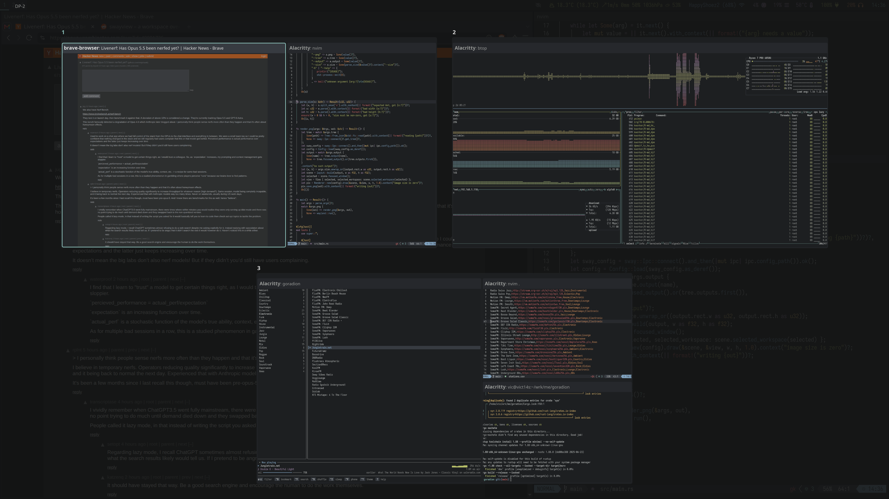

# swayview

A workspace overview for sway. Each display shows its own workspaces, every one
as a small copy of the screen, with windows labelled by app and title. It reads
the layout live from sway, with no daemon. On sway 1.12 and later, windows also
show their contents, live.



## Install

Needs sway 1.4 or later.

On Arch Linux: `yay -S swayview` (or `swayview-bin` for the prebuilt binary).

### Other distributions

Install the latest release binary (x86_64, glibc 2.35+) to `/usr/local/bin`:

```sh
curl -fsSL https://raw.githubusercontent.com/agejevasv/swayview/main/install.sh | sh
```

To install to `~/.local/bin` instead, without sudo, end the command with
`| PREFIX=~/.local sh`. Binaries are also on the
[releases page](https://github.com/agejevasv/swayview/releases).

Or build from source (Rust 1.89+ and libxkbcommon, e.g. `libxkbcommon-dev` on
Debian/Ubuntu):

```sh
make && sudo make install    # PREFIX and DESTDIR work as usual
```

## Setup

Bind it in your sway config. Pressing the key again closes it.

```
bindsym $mod+Tab exec pkill -x swayview || swayview
```

## Keys

| Key                     | Action                     |
|-------------------------|----------------------------|
| arrows, hjkl            | move selection             |
| Tab, Shift+Tab          | next / previous window     |
| Enter, click            | focus window               |
| 1 … 9, 0                | go to workspace 1 … 10     |
| Esc, click outside      | close                      |

## Config

Create `~/.config/swayview/config.yaml` with just the keys you want to change.
Mistakes are reported on stderr, so run `swayview` in a terminal to see them.

All keys, with their defaults:

```yaml
thumbnails: true          # live window contents, on sway 1.12 and later
fonts:
  app:                    # app name line, and workspace numbers
    family: "sans-serif"  # any fontconfig family, e.g. "Inter" or "monospace"
    size: 14
  title:                  # title line, and output name
    family: "sans-serif"
    size: 12
colors:                   # quote colors, since # starts a YAML comment
  backdrop: "#101216e0"
  output_name: "#8a93a5"
  workspace:
    fill: "#16181d"
    label: "#dde1e8"      # workspace number
    selected: "#285577"   # number of the workspace with the selection
    urgent: "#900000"     # number of a workspace with an urgent window
  window:                 # default to client.* colors from your sway config
    normal:
      border: "#333333"
      background: "#222222"
      text: "#888888"
    selected:
      border: "#4c7899"
      background: "#285577"
      text: "#ffffff"
    urgent:
      border: "#2f343a"
      background: "#900000"
      text: "#ffffff"
```

While the overview shows live thumbnails, windows on an output with a
fractional scale, such as 1.5, can look blurry
([sway#9113](https://github.com/swaywm/sway/issues/9113)). Set
`thumbnails: false` if that bothers you.
